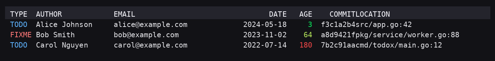

# todox — Git リポジトリ向け TODO/FIXME 探索ツール（日本語版）

[](https://github.com/phyten/todox/actions/workflows/lint.yml)
[](https://github.com/phyten/todox/actions/workflows/test.yml)
[](https://github.com/phyten/todox/actions/workflows/build.yml)
[](https://github.com/phyten/todox/actions/workflows/release.yml)

英語版 README は [README.md](./README.md) を参照してください。

`todox` はリポジトリ内の **大文字の `TODO` / `FIXME`** を検索し、
その行を**誰が追加・変更したのか**（最終 / 初回導入）を素早く洗い出せる CLI / Web ツールです。

- `--mode last`（既定）：その行を**最後に変更**した人（`git blame`）
- `--mode first`：その `TODO/FIXME` を**最初に導入**した人（`git log -L`）
- フィルタ：`--author`, `--type {todo|fixme|both}`
- 追加列：`--with-comment`（行本文を TODO/FIXME から表示）、`--with-message`（コミット件名 1 行目）、`--with-age`（AGE 列を追加）、`--full`
- 表示幅制御：`--truncate`, `--truncate-comment`, `--truncate-message`
- 出力：`table` / `tsv` / `json`
- 表の色付け：`--color {auto|always|never}`（`NO_COLOR` / `CLICOLOR` 等を自動検出）
- TODO/FIXME ラベルの配色は端末の背景の明暗に追従し、WCAG AA 相当のコントラストを確保します。
- 進捗表示：TTY のみ stderr に 1 行上書き、ETA/P90 を平滑化して表示（`--no-progress` あり）
- Web：`todox serve` で簡易 UI・JSON API・`/api/scan/stream` によるストリーミング進捗

> 実装の詳細や AI と協働する運用は [`AGENTS.md`](./AGENTS.md) を参照してください。

---

## クイックスタート

### Homebrew（macOS / Linux）

```bash
brew tap phyten/todox
brew install todox
# または: brew install phyten/todox/todox
```

### 依存

- `git`（内部で CLI を呼び出します）
- Go 1.22 以降（ソースからビルドする場合）

### ビルド & 実行（ローカル）

```bash
go mod tidy
make build
./bin/todox -h
```

### 例

```bash
# すべての TODO/FIXME の最終変更者（表形式）
./bin/todox

# FIXME だけ、初回導入者、行本文＋件名を 80 文字にトリム
./bin/todox --type fixme --mode first --full --truncate 80

# 作者名/メールで絞り込み（正規表現）
./bin/todox -a 'Alice|alice@example.com'

# 最古の TODO/FIXME から順に表示し、AGE 列を追加
./bin/todox --with-age --sort -age

# TSV / JSON で出力
./bin/todox --output tsv  > todo.tsv
./bin/todox --output json > todo.json
```

### Web モード

```bash
./bin/todox serve -p 8080
# -> http://localhost:8080 （API: /api/scan）
```

Web フォームはサーバー既定に合わせています。`ignore whitespace` チェックは最初から ON（= `ignore_ws=true`）で、`jobs` 欄は空欄（自動）。`path` / `exclude` / `path_regex` の各テキスト欄は空のままなら送信されず、`exclude typical dirs` チェックを ON にしたときだけ `exclude_typical=1` を送信します。既定のままならクエリに含めません。

SSE (`EventSource`) に対応したブラウザでは `/api/scan/stream` に接続し、`scan → attr → pr` のステージ進捗・処理速度・ETA をリアルタイムに表示します。キャンセルリンクはストリームを `close()` するだけなので、サーバー側のスキャンも即座に中断されます。SSE に対応していないブラウザでは自動的に従来どおりの `fetch(/api/scan)` にフォールバックします。フォールバック実行中のキャンセルは `AbortController` により即時中断されます。`with_pr_links=0` の場合は `pr` ステップは UI から非表示になり、断続的な回線では自動再接続（3 秒）中に "reconnecting…" が表示されます。

テーブルヘッダーをクリックすると結果をローカルでソートできます（昇順/降順のトグル、空欄は常に末尾へ移動します）。PRS 列は `#番号 タイトル (state)` の形式で表示され、リンクへホバーすると PR 本文の先頭 280 文字がツールチップとして表示されます。ツールチップでは空白が折り畳まれ、JSON ペイロード内の Markdown/本文は従来どおり生のまま保持されます。

サーバーは `progress`, `result`, `ping` に加えて `error` と `server_error` の両方を送信します（`server_error` が推奨、`error` は後方互換用）。クライアント側は `server_error` を優先しつつ、当面は `error` もフォールバックとしてハンドリングしてください。

---

埋め込み CSS は OS の `prefers-color-scheme` を参照してライト/ダークに追従し、TODO/FIXME バッジは WCAG AA を満たす前景/背景の組み合わせで表示されます。

---

## Dev Container（推奨の開発環境）

Dev Containers CLI を使ってリポジトリを再現性高く立ち上げられます。

```bash
devcontainer up --workspace-folder .
devcontainer exec --workspace-folder . bash
make build
```

> Codespaces でも `.devcontainer/devcontainer.json` が読み込まれます。
> ローカル CLI ではポート 8080 を publish 済みです（`runArgs -p 8080:8080`）。

---

## CLI オプション（抜粋）

### 検索・作者判定

- `-t, --type {todo|fixme|both}` : スキャン対象（既定: both）
- `-m, --mode {last|first}` : 作者の定義（既定: last）
- `-a, --author REGEX` : 作者名/メールの正規表現フィルタ（拡張正規表現）

### パスフィルタ

- `--path LIST` : 指定した pathspec のみを対象に検索（カンマ区切り・繰り返し可能）
- `--exclude LIST` : 指定した pathspec/glob を除外（カンマ区切り・繰り返し可能。`:(exclude)` や `:!` は尊重）
- `--path-regex REGEXP` : ファイルパスに Go の正規表現を適用（OR 条件でいずれかにマッチすれば残す）
- `--exclude-typical` : 典型的な除外セットをまとめて適用（`vendor/**`, `node_modules/**`, `dist/**`, `build/**`, `target/**`, `*.min.*`）

### 出力形式

- `-o, --output {table|tsv|json}` : 出力フォーマット（既定: table）
- `--fields type,author,date,...` : table/TSV の列順を指定（カンマ区切り。`--with-*` より優先）
- `--color {auto|always|never}` : 表形式に色付けするモード（既定: auto）

### 色付けと環境変数

- `--color auto` は端末能力を自動判定します。
  - `NO_COLOR` が設定されていれば常に無効（強制フラグより優先）。
  - `CLICOLOR=0` で自動判定を無効化（こちらも強制フラグより優先）。
  - `CLICOLOR_FORCE` / `FORCE_COLOR` に "0" 以外の値が入っていれば強制有効。
  - `TERM=dumb` の場合は常に無効（他の環境変数より優先）。
  - 上記以外では `stdout` が TTY かどうかで判断します（stderr の TTY は参照しません）。
- カラープロファイルも自動判定します。
  - `COLORTERM=truecolor|24bit` → AGE 列を True Color グラデーションで表示。
  - `TERM=*256color` → ANSI 256 色グラデーション。
  - それ以外は 8 色パレットでバケット化（TODO=黄, FIXME=赤, AGE は段階色。最終的なコントラストは端末パレットに依存）。
- AGE のグラデーションはリポジトリに応じて自動スケーリングされます。年齢の 95 パーセンタイル（下限 120 日）を
  「最も赤い値」として扱い、極端な古い TODO が全体を赤一色にしないよう調整しています。
- 端末が `COLORFGBG` を公開している場合は TODO/FIXME の色味を背景の明暗に合わせ、未知の場合は暗背景向けの配色を既定にします。
- `COLORFGBG` が未設定でも `TERM` に "light" が含まれていれば明背景と推定し、それ以外は暗背景扱いになります。
- True Color 環境では TODO/FIXME の前景色を WCAG AA コントラストに照らして検証します（256/8 色では意図した色味を維持しますが、最終的なコントラストは端末側パレットに依存します）。
- 色付き出力をパイプする場合は ANSI エスケープを解釈できるページャ（例: `less -R`）を利用してください。

```
todox --with-age --color always | less -R
```
- グラデーション付きのサンプル出力:



> JSON 出力には常に `age_days` フィールドが含まれます。
> `--with-commit-link` を有効にすると各 item に `url`、Result に `has_url` が追加されます。`--with-pr-links` を有効にすると各 item に `prs[]`、Result に `has_prs` が追加されます（エントリは `{number,state,url,title,body}` を含みます。新フィールドは追加のみなので既存クライアントとの後方互換性は保たれます）。これらは公開 API の一部であり将来も保持されます。
> `has_url` / `has_prs` は「データ取得済みか」の指標です（`--with-*` や `--fields` により内部取得されます）。列を非表示にしていてもメタ情報としては true になります。

`--fields` は「表示する列」のみを制御します。`--with-*` フラグや明示的に指定した列名に応じて内部取得は継続されます（例: `--fields type,url` だけを指定しても URL データは取得され、table/TSV/JSON で表示されます）。

`--fields` で指定できる列（table / TSV）:
- `type`, `author`, `email`, `date`, `age`, `commit`, `location`（`file:line`）
- `comment`, `message`
- `url`（エイリアス: `commit_url`）
- `pr`, `prs`, `pr_urls`

### 追加列（非表示が既定）

- `--with-comment` : TODO/FIXME 行を表示
- `--with-snippet` : `--with-comment` のエイリアス（後方互換用途）
- `--with-message` : コミットサマリ（1 行目）を表示
- `--with-age` : table / TSV に AGE（日数）列を追加
- `--with-commit-link` : URL 列を追加（GitHub 上の該当行リンク。既定では `origin` リモートを参照）
  - `--with-link` は後方互換のための非推奨エイリアスとして残しています。
  - CI 等で非推奨警告を抑止したい場合は `TODOX_NO_DEPRECATION_WARNINGS=1` を設定してください。
  - `origin` 以外を使う場合は `TODOX_LINK_REMOTE=<リモート名>` を設定してください（例: `upstream`）。
  - 社内 GHES など HTTP 配信のみの環境では `TODOX_LINK_SCHEME=http` を指定するとリンク生成に HTTP を使います。
  - リモート解析に失敗してもスキャン自体は成功し、URL 列は空欄・警告は `errors[]` / `error_count` に記録されます。
  - Markdown ファイルでは `?plain=1#L<n>` を付与し、GitHub のレンダリングビューとアンカー競合しないようにしています。
- `--with-pr-links` : コミットを含む PR 情報を追加
  - `--pr-state {all|open|closed|merged}` で状態フィルタ、`--pr-limit N`（1〜20、既定 3）で件数上限、`--pr-prefer {open|merged|closed|none}` で状態の優先順位を調整できます。
  - 有効化すると各 item に `{number,state,url,title,body}` の配列 `prs[]` が追加され、Result には `has_prs` が立ちます（空文字は `omitempty` で JSON から省かれます）。
  - プライベートリポジトリでは gh CLI の認証、または `GH_TOKEN` / `GITHUB_TOKEN` を環境変数に設定して REST API を利用してください。匿名リクエストはレートリミットに達しやすい点に注意してください。
  - PR 取得の並列度は `TODOX_GH_JOBS=<n>`（1〜32）で調整できます。既定では `jobs` の値と上限 32 の小さい方が採用されます。
- `--full` : `--with-comment --with-message` のショートカット

### 表示幅制御

- `--truncate N` : COMMENT/MESSAGE を両方 N 桁（表示幅）に丸める（0 で無制限）
- `--truncate-comment N` : COMMENT だけ（表示幅で）丸める
- `--truncate-message N` : MESSAGE だけ（表示幅で）丸める

表示幅は Unicode の wcwidth に準拠して計算され、結合文字や絵文字を壊しません。日本語端末などで曖昧幅を 2 として扱いたい場合は `TODOX_EASTASIAN=1`（または `true`）を設定してください。

### 並び替え

- `--sort key[,key...]` : 多段ソート。`-` で降順、`+`（または省略）で昇順を指定。
  利用可能キー: `age`, `date`, `author`, `email`, `type`, `file`, `line`, `commit`, `location`（`file,line`）。

### 進捗・ blame の振る舞い

- `--no-progress` / `--progress` : 進捗表示を抑止／強制
- `--no-ignore-ws` : `git blame` で `-w` を使わない（空白変更も最新扱い）
- Web API: `ignore_ws=0` で空白のみの変更も追跡し、`jobs=<n>` (1〜64) でワーカー数を制限できます

### ヘルプ・言語設定

- `-h, --help [en|ja]` : ヘルプを表示（既定は英語。`ja` で日本語）
- `--help=ja`, `--help-ja` : ワンショットで日本語ヘルプを表示
- `--lang {en|ja}` : 現在の実行に使うヘルプ言語を指定
- `GTA_LANG=ja`（環境変数）: 既定ヘルプ言語を日本語に変更（`GIT_TODO_AUTHORS_LANG` も使用可）

ヘルプ：`./bin/todox -h`（英語/日本語の両対応、例付き）

### GitHub 連携コマンド

- `todox pr find --commit <sha>` : 指定コミットを含む PR を一覧表示
- `todox pr open --commit <sha>` : 最初に見つかった PR をブラウザで開く
- `todox pr create --commit <sha>` : gh CLI 経由で PR を作成（`--source` や `--base` で調整可能）。`GH_TOKEN`/`GITHUB_TOKEN` があれば検索系は REST で動作しますが、PR 作成そのものには `gh` バイナリが必要です。

### 入力の正規化と検証（CLI / Web 共通）

CLI フラグと `/api/scan` のクエリパラメータは共通の正規化レイヤーで処理されます（特記がない限り、大文字小文字は区別しません）。

| パラメータ | 受理する値 | 検証内容 |
| --- | --- | --- |
| 真偽値フラグ（`--with-comment`、`with_comment`、`--with-message`、`with_message`、`--with-commit-link`、`with_commit_link`、`--with-pr-links`、`with_pr_links`、`ignore_ws` など。`--with-link` / `with_link` は非推奨エイリアス） | `1` / `true` / `yes` / `on` → true、`0` / `false` / `no` / `off` → false | 空文字は「未指定」扱い。それ以外の文字列はエラーになります。 |
| `--type`, `type` | `todo` / `fixme` / `both` | 未知の値はエラーになります。 |
| `--mode`, `mode` | `last` / `first` | 未知の値はエラーになります。 |
| `--output` | `table` / `tsv` / `json` | 未知の値はエラーになります（CLI のみ）。 |
| `--jobs`, `jobs` | 1〜64 の整数 | 範囲外はエラーになります。 |
| `--path`, `path` | pathspec / glob（カンマ区切り・繰り返し可） | 前後の空白は除去。空要素は無視します。 |
| `--exclude`, `exclude` | 同上 | `:(exclude)` や `:!` で始まる場合はそのまま尊重し、そうでなければ内部的に `:(glob,exclude)` を付与します。 |
| `--path-regex`, `path_regex` | Go の正規表現 | すべて事前にコンパイルし、不正なパターンは即エラーになります。 |
| `--exclude-typical`, `exclude_typical` | 真偽値（他のフラグと同じリテラル） | 組み込みの除外セットを有効化（`vendor/**`, `node_modules/**`, `dist/**`, `build/**`, `target/**`, `*.min.*`）。 |
| `--truncate`, `--truncate-comment`, `--truncate-message`（および API 版） | 0 以上の整数 | 負の値はエラーになります。COMMENT と MESSAGE を両方表示し、トランケート指定が無い場合は既定で 120 桁（表示幅）が適用されます。 |

`jobs` の既定値は `min(runtime.NumCPU(), 64)`（CPU コア数を 64 で上限）です。

---

## 注意・既知の制限

- `--mode first` は `git log -L` を多用するため、大規模リポジトリでは時間がかかります（進捗/ETA 表示あり）。
- `git` を必ずインストールしてください。コンテナ/Docker でもランタイムに `git` が必要です。
- 検索対象は **大文字の `TODO` / `FIXME`** のみです（小文字は対象外）。

---

## 開発（Make タスク）

- `make build` … `bin/todox` を生成
- `make serve` … Web モードで起動
- `make lint` … `golangci-lint run`（`golangci-lint` が PATH に必要）
- `make fmt` / `make vet` / `make clean`

---

## Lint

`golangci-lint` を使った静的解析を `make lint` で実行できます。

- 初回は `go install github.com/golangci/golangci-lint/cmd/golangci-lint@v2.4.0` でバイナリを取得してください。
- devcontainer の外から実行する場合は `./scripts/dcrun make lint` を推奨します。
- devcontainer 内のシェルであれば `make lint` をそのまま実行できます。
- GitHub Actions の `Lint` / `Test` / `Build` ワークフローで自動実行しています。

---

## Release

タグを `v*` 形式で push すると GitHub Actions の `Release` ワークフローが起動し、
Linux / macOS / Windows 向けのバイナリをクロスコンパイルしてリリースページに添付します。

Homebrew tap を自動更新したい場合は、事前に以下を準備してください。

- `phyten/homebrew-todox` のような tap リポジトリを作成（`Formula/todox.rb` をワークフローが自動生成します）
- tap リポジトリへ push 可能な PAT を発行し、`HOMEBREW_TAP_TOKEN` として Actions シークレットに登録

---

## ロードマップ（抜粋）

- `--with-age` 列を活かした追加の `--sort` / `--group-by` オプション
- リモート（GitHub/GitLab/Gitea）への行リンク生成
- Markdown / CSV 出力、fzf/TUI、`-M/-C` での行移動検出
- ファイル単位 blame の一括取得による高速化

---

## License

MIT
