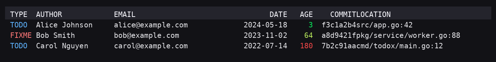

# todox — TODO/FIXME explorer for Git repositories

[](https://github.com/phyten/todox/actions/workflows/lint.yml)
[](https://github.com/phyten/todox/actions/workflows/test.yml)
[](https://github.com/phyten/todox/actions/workflows/build.yml)

`todox` scans your repository for uppercase **`TODO` / `FIXME`** markers and helps you
identify **who introduced or last touched** those lines in seconds—either from the CLI or a lightweight web UI.

- `--mode last` (default): show the **most recent author** of the line (`git blame`).
- `--mode first`: show the **original author** who introduced the TODO/FIXME (`git log -L`).
- Filtering options: `--author`, `--type {todo|fixme|both}`.
- Extra columns: `--with-comment`, `--with-message`, `--with-age`, `--full` (shortcut for comment+message with truncation).
- Length control: `--truncate`, `--truncate-comment`, `--truncate-message`.
- Output formats: `table`, `tsv`, `json`.
- Color-aware tables: `--color {auto|always|never}` with automatic detection of `NO_COLOR`, `CLICOLOR`, and friends.
- Progress bar: one-line TTY updates with smoothed ETA/P90 bands (disable with `--no-progress`).
- Web mode: `todox serve` exposes a minimal UI plus a JSON API and streaming progress via `/api/scan/stream`.

> For automation rules and AI collaboration guidelines, see [`AGENTS.md`](./AGENTS.md).
>
> 日本語ドキュメントは [README-ja.md](./README-ja.md) を参照してください。

---

## Quick start

### Homebrew (macOS / Linux)

```bash
brew tap phyten/todox
brew install todox
# or: brew install phyten/todox/todox
```

### Prerequisites

- `git` (the tool shells out to the Git CLI)
- Go 1.22 or newer (when building from source)

### Local build & run

```bash
go mod tidy
make build
./bin/todox -h
```

### Examples

```bash
# List TODO/FIXME items with the most recent author (table output)
./bin/todox

# Focus on FIXMEs, show the original author, truncate comment + subject to 80 characters
./bin/todox --type fixme --mode first --full --truncate 80

# Filter by author name or email (regular expression)
./bin/todox -a 'Alice|alice@example.com'

# Surface the stalest TODO/FIXME items first and display AGE in the output
./bin/todox --with-age --sort -age

# Export as TSV or JSON
./bin/todox --output tsv  > todo.tsv
./bin/todox --output json > todo.json
```

### Web mode

```bash
./bin/todox serve -p 8080
# -> http://localhost:8080 (JSON API: /api/scan)
```

The web form mirrors the server defaults: *ignore whitespace* starts checked (matching `ignore_ws=true`) and the *jobs* field is blank (auto). The `path`, `exclude`, and `path_regex` inputs are sent only when non-empty, and the *exclude typical dirs* checkbox emits `exclude_typical=1` when checked. Leaving everything untouched keeps the API behaviour unchanged.

---

## Dev Container (recommended development setup)

The provided Dev Container gives you a reproducible environment.

```bash
devcontainer up --workspace-folder .
devcontainer exec --workspace-folder . bash
make build
```

> GitHub Codespaces automatically reads `.devcontainer/devcontainer.json`.
> The local configuration publishes port 8080 (`runArgs -p 8080:8080`).

---

## CLI options (highlights)

### Search & attribution

- `-t, --type {todo|fixme|both}`: which markers to scan (default: both)
- `-m, --mode {last|first}`: author definition (default: last)
- `-a, --author REGEX`: filter by author name or email (extended regex)

### Path filtering

- `--path LIST`: limit the `git grep` scope to the provided pathspec(s). Accepts comma-separated values and repeated flags.
- `--exclude LIST`: exclude pathspecs/globs (comma-separated and repeatable). `:(exclude)` / `:!` prefixes are respected.
- `--path-regex REGEXP`: keep only matches whose file path satisfies any of the given Go regular expressions.
- `--exclude-typical`: enable the built-in exclude set (`vendor/**`, `node_modules/**`, `dist/**`, `build/**`, `target/**`, `*.min.*`).

### Output selection

- `-o, --output {table|tsv|json}`: choose the output format (default: table)
- `--fields type,author,date,...`: choose the columns for table/TSV (comma separated; overrides `--with-*`)
- `--color {auto|always|never}`: control terminal coloring for the table output (default: auto)

### Color mode & environment variables

- `--color auto` respects terminal capabilities:
  - `NO_COLOR` disables colors (and wins over any force flags).
  - `CLICOLOR=0` disables colors when auto-detected (also winning over force flags).
  - `CLICOLOR_FORCE`/`FORCE_COLOR` force-enable colors when set to anything other than `"0"`.
  - `TERM=dumb` disables colors regardless of other environment variables.
  - Otherwise the CLI checks whether `stdout` is a TTY (stderr is ignored).
- Color profiles are inferred automatically:
  - `COLORTERM=truecolor|24bit` → True Color gradients for the AGE column.
  - `TERM=*256color` → ANSI 256-color gradients.
  - Other terminals fall back to the basic 8-color palette.
- The AGE gradient scales itself to your repository. The 95th percentile of ages (with a minimum ceiling of 120 days)
  is treated as "fully red" so that outliers do not drown out day-to-day differences.
- When piping colored output, use a pager that preserves ANSI escapes, for example:

```
todox --with-age --color always | less -R
```
- Example output with gradients for AGE and colored TODO/FIXME markers:



> JSON output always includes an `age_days` field for each item.

### Extra columns (hidden by default)

- `--with-comment`: include the TODO/FIXME line text
- `--with-snippet`: alias of `--with-comment` (kept for backward compatibility)
- `--with-message`: include the commit subject (first line)
- `--with-age`: append an AGE (days since author date) column to table/TSV outputs
- `--full`: shorthand for `--with-comment --with-message`

### Truncation controls

- `--truncate N`: truncate both COMMENT and MESSAGE to `N` columns of visible width (0 = unlimited)
- `--truncate-comment N`: truncate only COMMENT (visible width)
- `--truncate-message N`: truncate only MESSAGE (visible width)

Display widths follow Unicode wcwidth rules: grapheme clusters (emoji, combining marks) stay intact. Set `TODOX_EASTASIAN=1` (or `true`) to treat ambiguous-width characters as double-width for East Asian terminals.

### Sorting

- `--sort key[,key...]`: multi-level sort. Prefix with `-` for descending, `+` (or nothing) for ascending.
  Supported keys: `age`, `date`, `author`, `email`, `type`, `file`, `line`, `commit`, `location` (`file,line`).

### Progress / blame behaviour

- `--no-progress` / `--progress`: disable or force the progress display
- `--no-ignore-ws`: run `git blame` without `-w` so whitespace-only edits are considered latest
- Web API: pass `ignore_ws=0` to honour whitespace edits and `jobs=<n>` (1–64) to cap worker concurrency

### Help & language

- `-h, --help [en|ja]`: show help (English by default, pass `ja` for Japanese)
- `--help=ja`, `--help-ja`: convenient aliases to show Japanese help immediately
- `--lang {en|ja}`: set the help language for the current invocation
- `GTA_LANG=ja` (environment): default to Japanese help (`GIT_TODO_AUTHORS_LANG` also works)

Full help: `./bin/todox -h` (bilingual output and examples).

### Input normalization & validation (CLI / Web)

Both the CLI flags and the `/api/scan` query parameters share the same normalization layer. All inputs are case-insensitive unless noted.

| Parameter | Accepted values | Validation |
| --- | --- | --- |
| Boolean flags (`--with-comment`, `with_comment`, `--with-message`, `with_message`, `ignore_ws`, etc.) | `1`, `true`, `yes`, `on` → `true`; `0`, `false`, `no`, `off` → `false` | Empty values mean "not specified". Any other literal returns an error. |
| `--type`, `type` | `todo`, `fixme`, `both` | Unknown values are rejected. |
| `--mode`, `mode` | `last`, `first` | Unknown values are rejected. |
| `--output` | `table`, `tsv`, `json` | Unknown values are rejected (CLI only). |
| `--jobs`, `jobs` | Integers in `[1, 64]` | Values outside the range are rejected. |
| `--path`, `path` | Pathspecs/globs, comma-separated or repeated | Values are trimmed. Empty entries are ignored. |
| `--exclude`, `exclude` | Same as above | `:(exclude)` / `:!` prefixes are preserved; otherwise `:(glob,exclude)` is added internally. |
| `--path-regex`, `path_regex` | Go regular expressions | Each entry must compile. Invalid patterns return an error. |
| `--exclude-typical`, `exclude_typical` | Boolean (same literals as other flags) | Enables the built-in set: `vendor/**`, `node_modules/**`, `dist/**`, `build/**`, `target/**`, `*.min.*`. |
| `--truncate`, `--truncate-comment`, `--truncate-message` (and the API equivalents) | Integers ≥ 0 | Negative values are rejected. When both COMMENT and MESSAGE columns are enabled and no truncate is supplied, a default of 120 display columns is applied. |

Default for `jobs`: `min(runtime.NumCPU(), 64)` (number of CPU cores capped at 64).

---

## Caveats & known limitations

- `--mode first` relies heavily on `git log -L`, which can be slow on very large repositories. A progress bar and ETA are displayed.
- `git` must be available at runtime—even inside containers.
- Only uppercase `TODO` / `FIXME` markers are detected.

---

## Development (Make targets)

- `make build`: produce `bin/todox`
- `make serve`: launch the web UI
- `make lint`: run `golangci-lint` (binary must be on `PATH`)
- `make fmt` / `make vet` / `make clean`

---

## Linting

Static analysis is powered by `golangci-lint` via `make lint`.

- Install the binary once with `go install github.com/golangci/golangci-lint/cmd/golangci-lint@v2.4.0`
- Outside the dev container, prefer `./scripts/dcrun make lint`
- Inside the container, `make lint` works directly
- CI runs the `Lint`, `Test`, and `Build` workflows automatically

---

## Release process

Pushing a `v*` tag triggers the `Release` workflow, which cross-compiles binaries for Linux, macOS, and Windows and attaches them to the GitHub release.

To update a Homebrew tap automatically, prepare:

- A tap repository such as `phyten/homebrew-todox` (the workflow generates `Formula/todox.rb`)
- A personal access token with push permission stored as the `HOMEBREW_TAP_TOKEN` secret

---

## Roadmap (highlights)

- Additional sorting/grouping options building on the new `--with-age` column
- Deep links to remote hosts (GitHub / GitLab / Gitea)
- Additional outputs (Markdown, CSV), fzf/TUI integration, detection of moved lines via `-M/-C`
- Faster scans by batching file-level blame queries

---

## License

MIT
